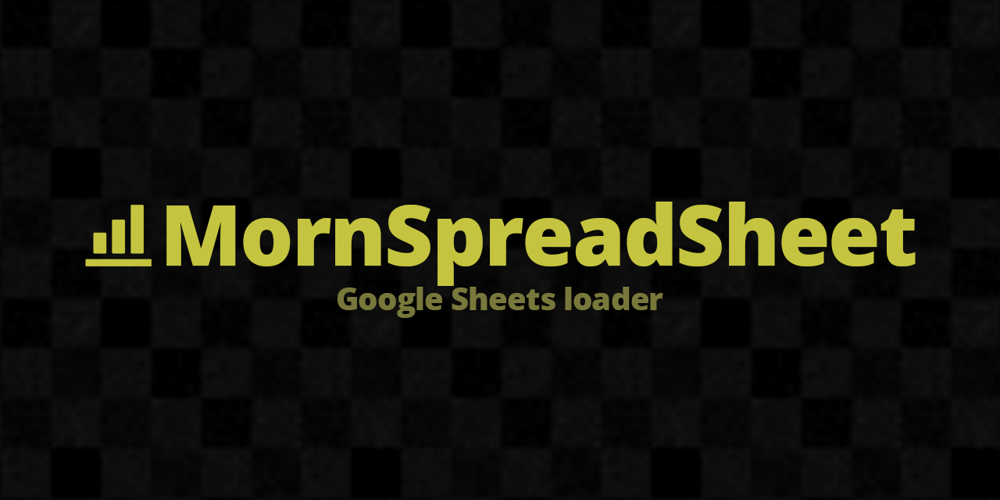

# MornSpreadSheet

<p align="center">
  
</p>

<p align="center">
  
</p>

## 概要

Google Sheets から CSV でデータを取得し、マスターデータとして扱うための Unity 向けローダー。Editor 上でダウンロード、ScriptableObject へ保存、GAS テンプレート付属。

## 導入方法

Unity Package Manager で以下の Git URL を追加:

```
https://github.com/TsukumiStudio/MornSpreadSheet.git?path=src#1.0.0
```

`Window > Package Manager > + > Add package from git URL...` に貼り付けてください。

### 依存パッケージ

- [UniTask](https://github.com/Cysharp/UniTask) (`com.cysharp.unitask`)

## ライセンス

[The Unlicense](LICENSE)
